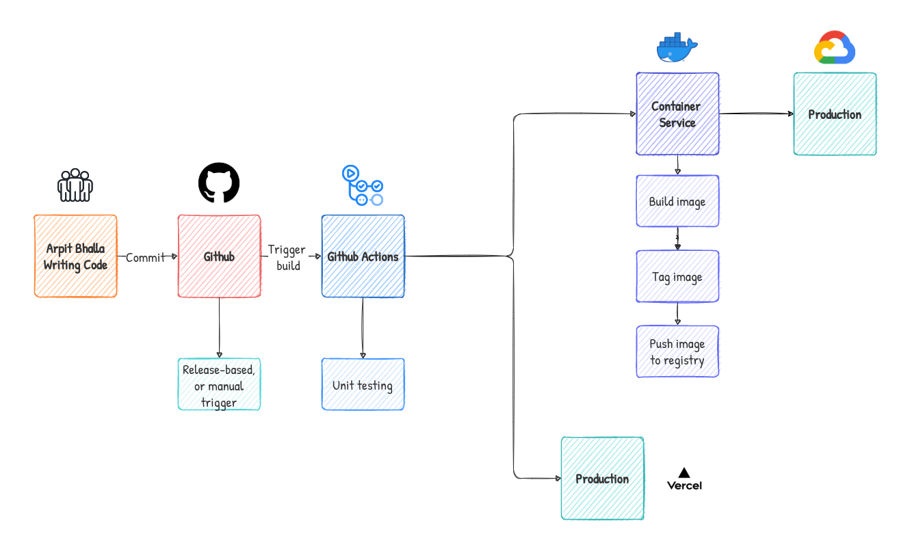

<div align="center">

 
<h1>Teams</h1>


A multi-participant video call platform for calling across the world for free with screen sharing!
</div>


## 🤞 Made possible with

<div>


</div>

## 🧐 Feature list

### Basic features

- Schedule 📅 meets, send invite via email 📩 & save to calender.
- Create public 🌐 or restricted ☢️ meeting.
- Connect with multiple users via meeting link or code.
- Toggle dark 🌑 or light 🌕 mode anytime.
- Realtime chat 💬, connect before or after the meeting.
- Audio notification 🔔 for chat and new user connect
- Screen Sharing 💻
- Select camera 📷 & audio 🎙️ sources.
- Mute 🔇 Other Participants (only host)
- Remove ⛔ Other Participants (only host)

### Classroom specific features

- Realtime whiteboard 📋 with multiple tools.
- Take attendance <u>`anytime`</u> during lecture (Non attentive students will miss theirs 😈).
- Get notified if student changes tab or doing other activities during lectures. 😹 (Yet they can do it on mobile phones)

### Code features

- 100% strict typescript
- `eslint` and `prettier` friendly code
- Code splitting using `@loadable/component`
- Hooks like `React.useCallback` `React.memo` which will increase performance.
- Unit tested with `jest` & `e2e` tested with `cypress`.
- Proper use of `/** comments */` and descriptions for functions.

## 🚀 Getting started

Guide for local deployment -

1. Clone the repository

```bash
git clone git@github.com:arpitBhalla/MicrosoftEngageMentorship2021.git
```

2. Change the working directory

```bash
cd server
```

3. Install dependencies

```bash
npm install
```

4. Change the working directory

```bash
cd client
```

5. Install dependencies

```bash
npm install
```

6. Run the app

```bash
npm start # in client directory /client
```

```bash
npm start # in server directory /server
```

7. Open project at `http://localhost:3000`

<div align="center">

🌟 You are all set!

</div>

## Workflow



## Lighthouse


<div align="center">
Developed with ❤️ in India 🇮🇳 by

[@arpitBhallla](https://github.com/arpitBhalla)

</div>
